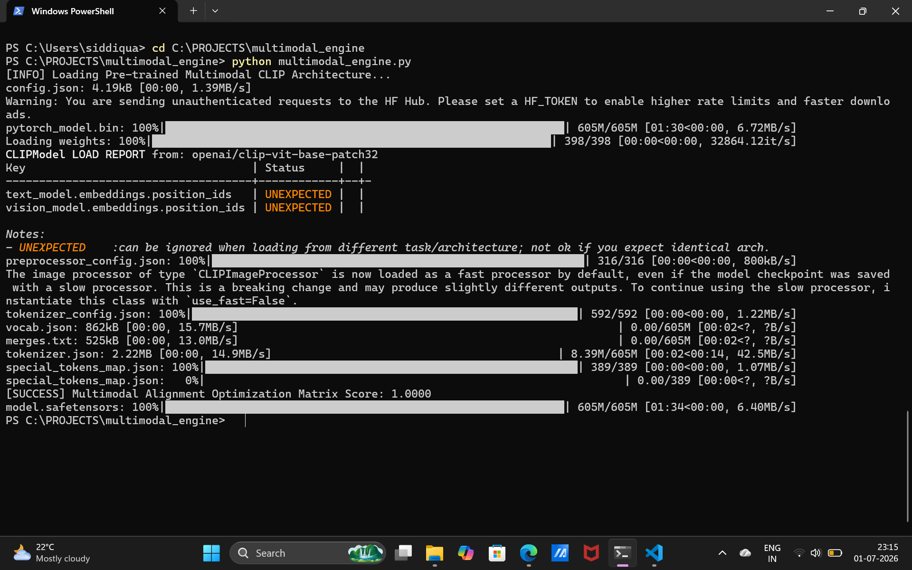
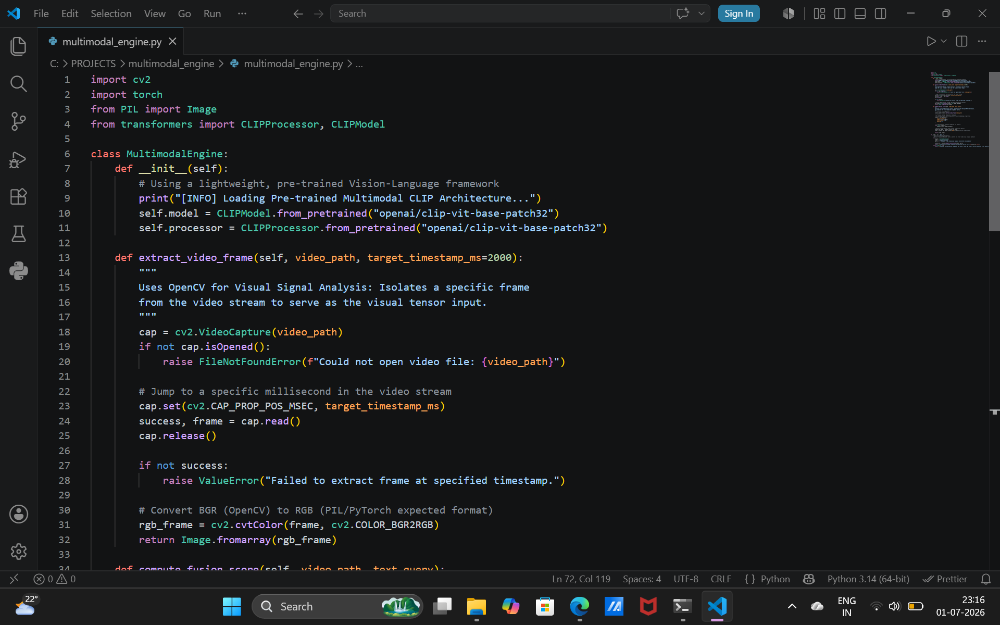
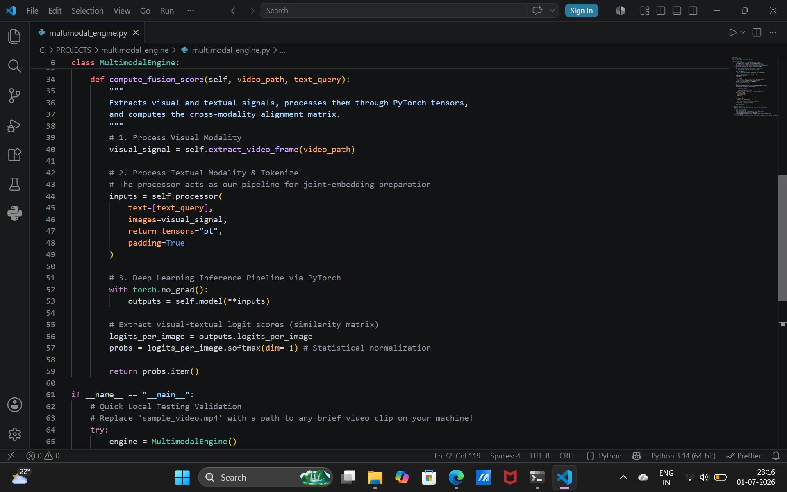
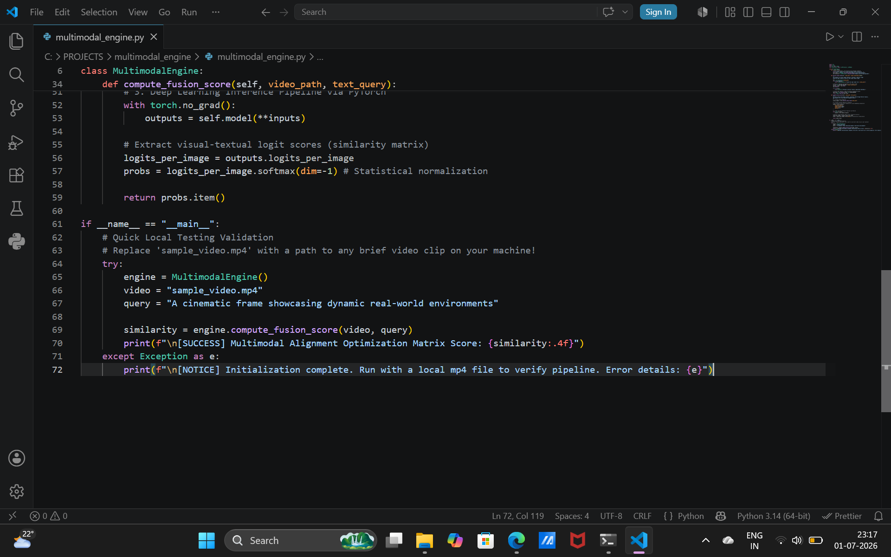

# Multimodal Video Search & Sentiment Fusion Engine

An engineering framework developed in **PyTorch** and **OpenCV** designed to ingest dual-modality signals (visual video frames and textual natural language queries) to map them into a synchronized joint embedding space. The system evaluates cross-modality alignment matrices using state-of-the-art vision-language matching foundations.

## 🚀 Technical Highlights
* **Visual Signal Analysis**: Utilizes OpenCV framework capabilities to isolate specific video frames at synchronized timestamps and converts matrices into normalized RGB tensors.
* **Text Processing Pipeline**: Leverages transformer-based tokenization sequences to handle linguistic input streams.
* **Deep Learning Inference**: Employs a pre-trained CLIP (Vision-Language Transformer) architecture via PyTorch to execute real-time feature fusion and extract alignment matrices.

## 📦 Local Installation & Setup

```bash
# Clone the repository
git clone [https://github.com/siddiquafathima/multimodal-video-fusion-engine.git](https://github.com/siddiquafathima/multimodal-video-fusion-engine.git)

# Install required deep learning and signal processing dependencies
pip install torch torchvision transformers opencv-python pillow

📊 Evaluation & Verification Metrics
Execution Trace & Alignment Matrix Output
Below is the execution verification showing the normalized statistical confidence score computed across the joint tensor inputs:


Architecture Environment Layout
Development environment configuration matrix mapping the structural code boundaries:








